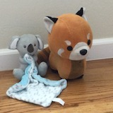

<!--  -->

## Welcome to Kamala Fox Story Page

###  Kamala fox story
**_This is Kamala fox_**

_I am inside a pyramid. I am trying to find  golden jewelry. 
I can make a necklace for my mom with that.
I am in the first chamber. I have to go through more chambers to get to the fox chamber.
The jewel is there. I am moving toward that. 
There are two obstacles. A lava lake and a glacier. 
For lava lake there is a bridge control. There are three colored button. 
Push the red one while pushing blue lever. Then turn the wheel 
Then the bridge will appear then I cross. 
I found a cup that can hold the lava from lava lake so that I can make a tunnel in the glacier to get to the fox chamber. 
and I did.
Now I have to find the jewel._ 

_There is small slot and I found a card in that. There is an another slot where the card goes that opens the box where the jewel is. 
Now I got the jewel. I am getting out of the pyramid. 
My cell phone went out of charge but when climbing out of the pyramid saw a small opening where sun light was coming._

_I was able the charge my cell phone and got out of the pyramid. 
I have to call my pilot now to come take me back home. 
The plane came and brought me back home.  
Gave the jewelry to my mom. She was very happy._

**End of story.**

 "kamalaFox1.jpg")

<b>Image Photo by SuiteCase Friend</b>

### _Thank You for visiting my page_
